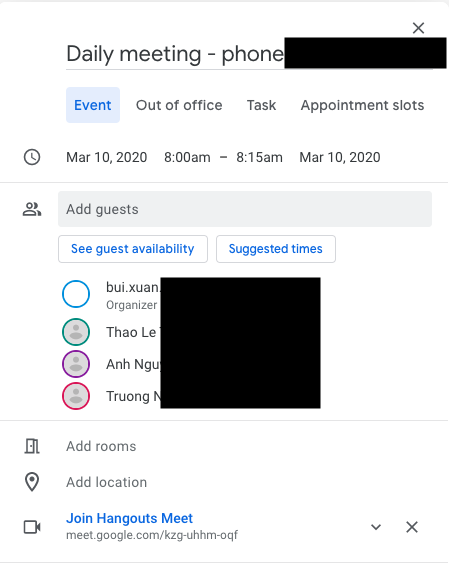

# Communication

## 1. Document Purpose

This guideline document's aim is to guide and unite the daily communication methods for the whole project team when working remotely.

## 2. Content

### 2.1. Early morning meeting

- Conduct meeting via Hangout: Group Leaders create morning meeting schedule on Gsuite calendar and invite project team members, then conduct the meeting via Hangout meeting link.
- Camera should be used to make team feel closer and share information easier.
- If a member do not join the meeting on time, it is considered as coming to work late and would be commented.

  

### 2.2. During working time

- All project team members have to be online and join Hangout meeting from 7:45 to 16:45 as in company rule of working time.
- When a member needs to be out of Hangout meeting for over 10 minutes, he/she must get the permission from Team Leader.
- Choose a quiet working place with noise restriction to avoid impacts to other team members.
- Do not use VPN for any other purpose than working to avoid impacts to communication quality.
- If there are any online late/leaving early needs, members must request Team Leader and Group Leader following company rules.
- During working time, if there is no responses via Hangout meeting or chat for over 10 minutes, members have to give explanation to Team Leader and Group Leader.

### 2.3. At the end of morning working time

- All project team members are required to summarize their morning tasks progress at 11:30, before lunch time.

### 2.4. At starting of afternoon working time

- All project team members have 5 minutes for greetings before afternoon working time.

### 2.5. At the end of working day time

- All project team members are required to send daily report and inform Team Leader / Group Leader, then after receiving confirmation from Team Leader / Group Leader, members could leave Hangout meeting.
