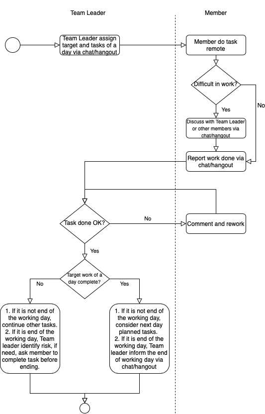

# Performance

## 1. Purpose

- This is the guideline document for Group Leader/Project Leader/Team Leader to manage performance in case of remote working. Its aim is to ensure the productivity and quality of the whole project team, and to achieve the same result as working at company office.

## 2. Application scope

- Group Leader, Project Leader, Team Leader and members working remotely.

## 3. Guidance

  

### Attention

1. Team Leader assign target work clearly and quantitatively: How many tasks, task priority, definition of done,...
1. Team Leader regularly confirm with members the progress (at least twice per day).
1. If members do not complete the target work, Team Leader need to base on the overall project progress
to identify and analyze risk.
1. If a member have more than 2 days in a week not complete the target work, Team Leader need to remind
and consider to ask him/her to go to work at company office.
