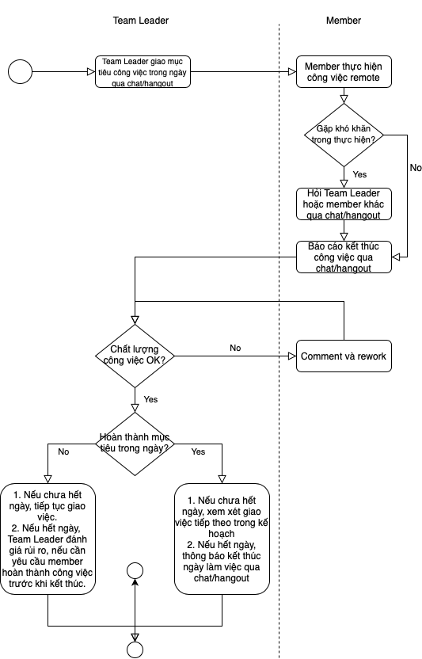

# Đánh giá

## 1. Mục đích:

- Đây là tài liệu hướng dẫn các Group Leader/Project Leader/Team Leader quản lý performance của member khi làm việc remote. Nhằm đảm bảo được năng suất và chất lượng của cả team, hướng tới thành quả như khi làm việc tại công ty.

## 2. Phạm vi áp dụng:

- Các Group Leader/ Project Leader/ Team Leader và các member đang làm remote.

## 3. Hướng dẫn

  

### Chú ý:

1. Team Leader giao mục tiêu công việc hàng ngày rõ ràng ví dụ: Bao nhiêu task, mức độ ưu tiên, thế nào là done
1. Team Leader thường xuyên hỏi member về tiến độ (ít nhất 1 ngày 2 lần)
1. Nếu member không hoàn thành mục tiêu công việc trong ngày cần đánh giá rủi ro dựa trên tiến độ chung cả dự án
1. Nếu member có hơn 2 ngày trong 1 tuần không hoàn thành mục tiêu thì cần nhắc nhở và xem xét để yêu cầu đến công ty làm việc, không làm remote nữa.
